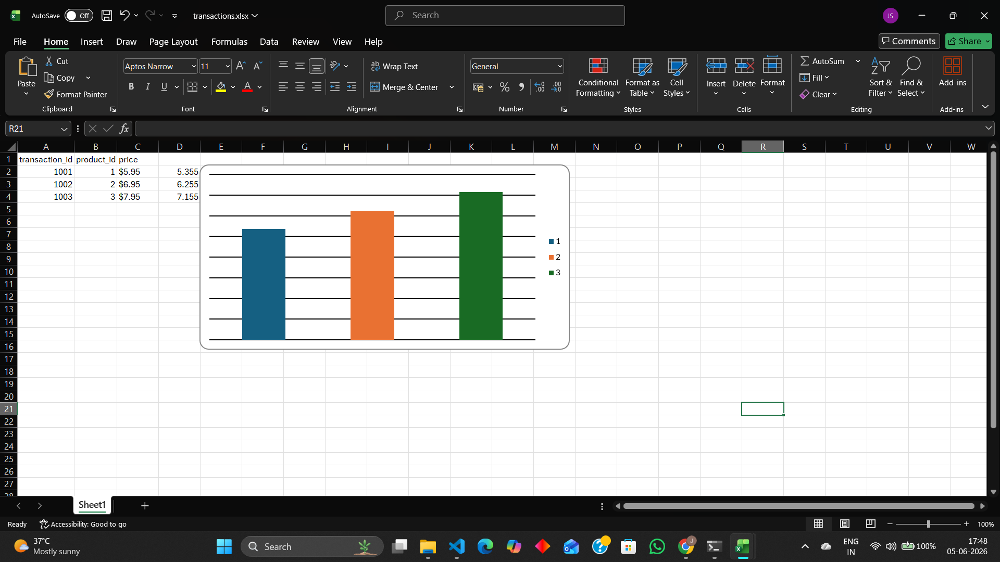

# Excel Automation with Python

This project demonstrates how to automate Excel tasks using Python and OpenPyXL.

## Features

- Read data from Excel
- Calculate discounted values
- Write results to a new column
- Generate a bar chart automatically

## Technologies Used

- Python
- OpenPyXL

## Output



The script processes transaction data, updates the workbook, and generates a bar chart automatically.

## How to Run

1. Install OpenPyXL

```bash
pip install openpyxl
```

2. Place `transactions.xlsx` in the project directory.

3. Run:

```bash
python xl_automation.py
```

4. Open the updated Excel file to view the calculated values and chart.
